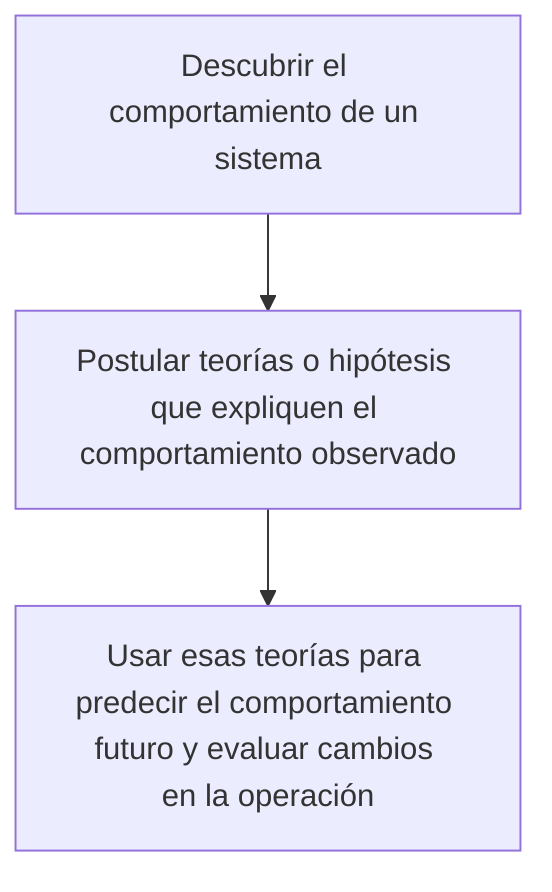
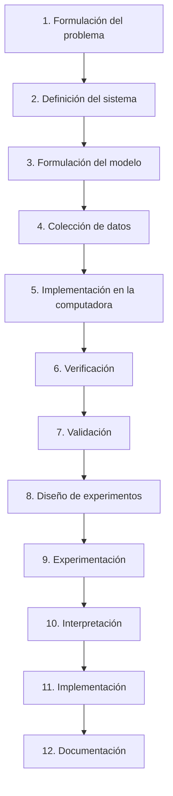
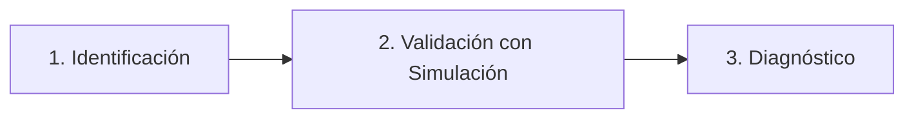
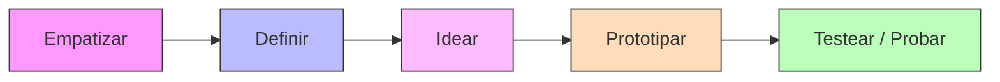
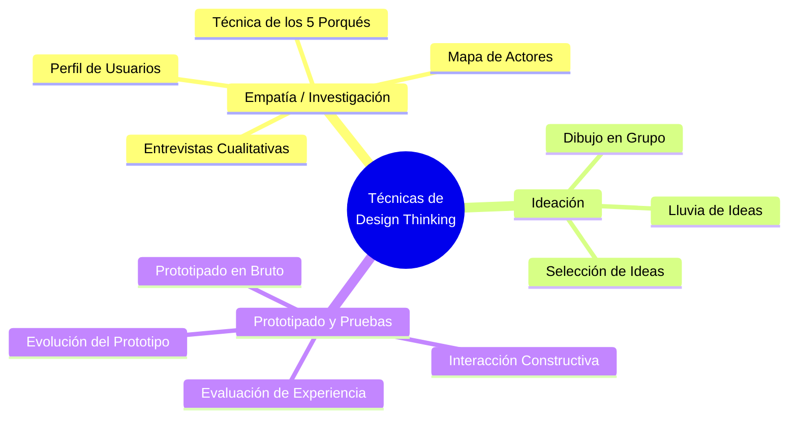

# Guía de Estudio Completa: Segundo Parcial
**Universidad Católica de Santiago de Guayaquil**  
**Semestre:** A-2026  
**Materia:** Simulación / Solución de Problemas de Ingeniería

Este documento contiene un resumen estructurado, detallado y optimizado de las clases correspondientes al segundo parcial. Está diseñado para facilitar el estudio de conceptos, etapas, metodologías y herramientas clave.

---

## 📌 Índice de Contenidos
1. [Clase 1: Simulación en Solución de Problemas](#clase-1-simulación-en-solución-de-problemas)
2. [Clase 2: Problemas, Soluciones y Requerimientos](#clase-2-problemas-soluciones-y-requerimientos)
3. [Clase 3: Metodología Design Thinking (Introducción y Fases)](#clase-3-metodología-design-thinking-introducción-y-fases)
4. [Clase 4: Técnicas y Herramientas de Design Thinking](#clase-4-técnicas-y-herramientas-de-design-thinking)
5. [Clase 5: Eficiencia vs. Eficacia y Matriz de Criterios Ponderados](#clase-5-eficiencia-vs-eficacia-y-matriz-de-criterios-ponderados)
6. [Clase 6: Metodología Kanban](#clase-6-metodología-kanban)

---

## Clase 1: Simulación en Solución de Problemas

### 1. ¿Qué es la Simulación?
La **simulación** es el proceso de diseñar un modelo de un sistema real y llevar a cabo experimentos con él. El fin de la simulación es:
* Comprender el comportamiento del sistema.
* Evaluar nuevas estrategias para operar el sistema bajo límites impuestos por ciertos criterios.
* Representar la dinámica temporal de los sucesos cuando se desarrollan a lo largo del tiempo.

### 2. ¿Qué Intenta la Simulación?
La simulación intenta responder a tres necesidades fundamentales:


### 3. Funcionamiento del Proceso de Simulación
1. **Repetibilidad:** La simulación debe realizarse **miles de veces** para generar un resultado representativo y confiable.
2. **Conocimiento:** La información de la simulación permite asistir en el diseño de estrategias basándose en el conocimiento adquirido.
3. **Tendencias:** Los resultados acumulados se transforman en una tendencia que ayuda a anticipar efectos en el mundo real.

### 4. Etapas de la Simulación
Un proyecto de simulación completo consta de **12 etapas sucesivas**:



* **1. Formulación del problema:** Se establece el objetivo de la simulación, resultados esperados, plan de experimentación, tiempo disponible, variables de interés e interfaz.
* **2. Definición del sistema:** Se delimita el sistema real a estudiar, sus alcances, limitaciones y restricciones de la abstracción.
* **3. Formulación del modelo:** Definición de todas las variables del modelo y sus relaciones lógicas. Se especifica el diagrama de flujo lógico.
* **4. Colección de datos:** Recopilación de datos reales para estimar las variables y los parámetros de entrada.
* **5. Implementación en la computadora:** El modelo es desarrollado utilizando algún lenguaje de computación o software de simulación.
* **6. Verificación:** Inspección a lo largo del proyecto para comprobar que el modelo fue construido según las especificaciones técnicas iniciales.
* **7. Validación:** Prueba de la concordancia entre el desempeño del modelo simulado y el desempeño del sistema real.
* **8. Diseño de experimentos:** Se deciden los parámetros experimentales: tiempo de arranque, tiempo de simulación y cantidad de réplicas.
* **9. Experimentación:** Ejecución de las simulaciones y recolección/procesamiento de los resultados.
* **10. Interpretación:** Análisis de los resultados para determinar la utilidad del modelo ante el problema planteado y tomar decisiones.
* **11. Implementación:** Uso del modelo para la operación. Se debe evitar el mal manejo del simulador o el mal empleo de sus resultados.
* **12. Documentación:** Registro completo del desarrollo, operation e implantación del modelo de simulación.

### 5. Factores Críticos en el Desarrollo
Para asegurar la validez de un modelo de simulación, se deben considerar:
* **Generación de variables aleatorias no-uniformes:** Modelado adecuado de la incertidumbre.
* **Lenguajes de programación:** Selección de herramientas adecuadas.
* **Condiciones iniciales:** El estado de arranque del sistema.
* **Tamaño de la muestra:** Número de corridas para lograr significancia estadística.
* **Diseño de experimentos:** Estructuración metodológica de las pruebas.

### 6. Ventajas de la Simulación
> [!NOTE]
> **Reducción de costos:** Permite experimentar con diversas configuraciones sin construir prototipos físicos costosos.  
> **Seguridad:** Posibilidad de probar escenarios peligrosos o de alto riesgo (ej. industria nuclear o aeronáutica) sin arriesgar vidas o equipos.  
> **Optimización de diseños:** Exploración de un amplio rango de parámetros para encontrar la mejor solución técnica.  
> **Estudio de comportamientos complejos:** Ayuda a entender sistemas difíciles de analizar mediante mediciones físicas o analíticas directas.

---

## Clase 2: Problemas, Soluciones y Requerimientos

### 1. Etapa 1: Del Problema al Diagnóstico
Todo proyecto de ingeniería nace de una **brecha** entre la situación actual (lo que ocurre) y la situación deseada (lo que debería ocurrir). El flujo metodológico es:



* **Identificación:** Detección de síntomas usando técnicas del primer parcial (Diagrama de Ishikawa, Árbol de Problemas o los *5 Porqués*).
* **Validación con Simulación:** Recreación matemática o visual del escenario crítico antes de invertir capital, mostrando exactamente dónde está el fallo.
* **Diagnóstico:** Obtención de datos duros que demuestran: *"El proceso falla exactamente aquí"*.

### 2. Etapa 2: El Requerimiento (El Puente Técnico)
Una vez diagnosticado el problema, no se programa ni se construye a ciegas; se traduce el problema en **Requerimientos**.
> [!IMPORTANT]
> El requerimiento es el **contrato técnico** de la solución. Representa la formalización de la solución ideal sobre el papel.

El proceso general de desarrollo es:
1. **Análisis del problema:** Entenderlo y descomponerlo en tres aspectos fundamentales (facilita la comprensión de cualquier tipo de problema) siguiendo convenciones.
2. **Diseño de la solución:** Traducir los requerimientos en un diseño viable.
3. **Construcción de la solución:** Implementación técnica usando herramientas y lenguajes adecuados.

### 3. Clasificación: Requerimientos Funcionales vs. No Funcionales

| Característica | Requerimiento Funcional | Requerimiento No Funcional |
| :--- | :--- | :--- |
| **Enfoque** | ¿Qué debe hacer el sistema? | ¿Cómo debe hacerlo? |
| **Definición** | Operaciones y servicios que el sistema debe proveer al usuario. Están directamente relacionados con el problema a resolver. | Restricciones, condiciones o criterios de calidad impuestos por el cliente o el entorno sobre la solución. |
| **Impacto** | Determina las **capacidades básicas** del sistema. | Define **criterios de calidad** y restricciones de rendimiento o entorno. |

#### Ejemplo Integrado (Sistema de Bombeo Industrial)
* **Requerimientos Funcionales:**
  * Debe bombear 100 litros por minuto.
  * Debe activarse automáticamente cuando el nivel de agua supere los 80 cm.
* **Requerimientos No Funcionales:**
  * Debe funcionar al menos 5 años sin fallos mayores (fiabilidad).
  * El nivel de ruido no debe superar los 60 dB (restricción ambiental).
  * Debe cumplir con la norma de seguridad IEC 60034 (regulación).

### 4. Identificación de Requerimientos
Para estructurar los requerimientos básicos, se deben buscar respuestas a:
* ¿Cuál es el proceso básico de la empresa?
* ¿Qué datos utiliza o produce este proceso?
* ¿Cuáles son los límites impuestos por el tiempo y la carga de trabajo?
* ¿Qué controles de desempeño utiliza?

#### Elementos clave a mapear
* **Procesos:** Actividades del sistema.
* **Flujos de datos:** Movimiento de información entre procesos.
* **Datos de cada flujo:** Estructura de la información.
* **Bases de datos:** Repositorio de persistencia.
* **Datos de las bases de datos:** Campos e información almacenada.

---

## Clase 3: Metodología Design Thinking (Introducción y Fases)

### 1. ¿Qué es Design Thinking?
Es una metodología o proceso centrado en el ser humano que facilita la solución de problemas, el diseño y desarrollo de productos o servicios de cualquier tipo. Se fundamenta en:
* Equipos multidisciplinarios y altamente motivados.
* La innovación y la creatividad como motores principales.
* **El ser humano como el centro de atención** absoluto del proceso.

### 2. ¿Para qué sirve?
* Resolver problemas de forma creativa e innovadora.
* Diseñar y desarrollar productos o servicios desde cero.
* Rediseñar procesos de negocios ineficientes.
* Emprender y crear nuevas empresas (*Startups*).
* Diseñar presentaciones de negocios de alto impacto.

### 3. Fases del Design Thinking (Paso a Paso)
El proceso tradicional se compone de 5 fases iterativas:



1. **Empatizar:** Conectarse directamente con los clientes y/o usuarios potenciales para comprender profundamente sus necesidades, realidades y dolores.
2. **Definir:** Analizar los hallazgos y necesidades identificadas para definir el problema o reto central sobre el cual el equipo se enfocará.
3. **Idear:** Fase creativa de ideación. Se parte de la necesidad del cliente para proponer múltiples soluciones sin juzgarlas, filtrando luego las más viables.
4. **Prototipar:** Construcción de maquetas o prototipos rápidos y económicos que materialicen la idea seleccionada para hacerla tangible.
5. **Testear o probar:** Validar el prototipo con los usuarios reales para comprobar si responde efectivamente a la solución deseada.

### 4. Características Principales
* **La generación de empatía:** Entender los problemas, necesidades y deseos de los usuarios mediante la interacción directa.
* **El trabajo en equipo:** Valorar la singularidad y aportaciones de cada miembro del grupo.
* **La generación de prototipos:** Propiciar la identificación temprana de fallos para resolverlos antes de la producción final.
* **Contenido visual y plástico:** Trabajar de forma creativa y analítica usando medios visuales para lograr soluciones factibles e innovadoras.

### 5. Casos de Estudio Reales
* **Rediseño de Máquinas de Resonancia Magnética (MRI) Infantiles:** Al ver que el 80% de los niños requerían sedación por el miedo a la máquina (oscura y ruidosa), se aplicó Design Thinking para transformarlas visualmente en barcos piratas, naves espaciales y submarinos. Esto bajó drásticamente la tasa de sedación y mejoró la experiencia de diagnóstico.
* **Airbnb:** Al necesitar transformar su marca, contrataron a *Design Studio*, quienes aplicaron la metodología enviando a empleados a hospedarse en Airbnbs en todos los continentes para vivir la experiencia real del viajero y del anfitrión, logrando redefinir su identidad basada en la pertenencia y conexión humana.

---

## Clase 4: Técnicas y Herramientas de Design Thinking

El proceso creativo y de análisis de Design Thinking se apoya en técnicas específicas para cada una de sus etapas:



### 1. Mapa de Actores
Identifica a todos los actores que participan en el uso de un producto o servicio y refleja gráficamente sus conexiones. Ayuda a definir a quiénes se debe investigar primero.
* **Clasificación de actores:**
  * **Actores directos:** Personas plenamente comprometidas en el proyecto.
  * **Actores indirectos:** Factores externos que influyen indirectamente en el proyecto.
  * **Usuarios:** Personas en el epicentro de la solución. Las decisiones se toman para su beneficio directo.
* **Preguntas clave para el análisis:**
  * ¿Cuál es su principal motivación?
  * ¿Cuáles son las implicaciones emocionales o financieras al contribuir al proyecto?
  * ¿Qué información requieren?
  * ¿Cuál es la mejor manera de comunicarse con ellos?
  * ¿Quién influye en sus opiniones?

### 2. Técnica de los 5 Porqués
Herramienta de interrogación utilizada durante las entrevistas cualitativas cuando el usuario responde de forma corta o monosilábica. Ayuda a profundizar hasta los motivos reales del comportamiento o pensamiento.

### 3. Entrevistas Cualitativas
Conversaciones preparadas de aproximadamente una hora en un entorno cómodo. Buscan entender motivaciones, emociones y experiencias reales (dolores, necesidades y deseos) del usuario.

### 4. Perfil de Usuarios (User Personas)
Ficha resumen de cada arquetipo de persona con el que se interactuó en la fase de Empatía. Describe sencillamente sus hábitos, frustraciones, personalidad, objetivos y necesidades para tenerlos presentes en el diseño.

### 5. Lluvia de Ideas (Brainstorming)
Actividad clave para generar el grueso de ideas en la fase de ideación. Sus **reglas fundamentales** son:
1. Una sola conversación por turno.
2. Buscar la máxima cantidad de ideas.
3. Construir sobre las ideas de los demás.
4. Fomentar ideas locas, salvajes o extremas.
5. Mantener el foco en el tema principal.
6. ¡Dibujar! Plasmar las ideas de forma visual.
7. No juzgar negativamente (sin filtros).

### 6. Selección de Ideas
Decisión grupal sobre qué ideas se desarrollarán. Cada miembro del equipo recibe **3 votos** para asignar a las ideas con mayor potencial. Se busca lograr una selección diversa e innovadora.

### 7. Dibujo en Grupo
Fomentar la co-creación del equipo plasmando en un único dibujo común las aportaciones de todos con respecto a una idea de solución.

### 8. Prototipado en Bruto
Agilizar la definición de soluciones mediante el desarrollo de prototipos rápidos usando cualquier material al alcance (cartón, papel, plastilina, etc.). Facilita la comunicación interna y aclara las ideas.

### 9. Interacción Constructiva (Think Aloud)
Prueba en la que se le pide a un usuario realizar ciertas tareas con el prototipo y relatar sus pensamientos en voz alta a medida que las ejecuta. El equipo observa y anota todo sin interferir en la prueba.

### 10. Evaluación de la Experiencia
Validación de la solución frente a la experiencia del usuario para verificar si se ajusta adecuadamente a su contexto real.

### 11. Evolución del Prototipo
Hacer que el usuario pruebe el prototipo en el entorno real donde se implementará la solución, permitiendo observar el impacto de factores externos no controlados.

---

## Clase 5: Eficiencia vs. Eficacia y Matriz de Criterios Ponderados

### 1. Eficiencia vs. Eficacia
En ingeniería y administración de proyectos es crucial comprender la diferencia de estos dos términos:

* **Eficacia:** Es la capacidad de cumplir con un objetivo establecido. Se enfoca en **hacer lo correcto** y alcanzar el resultado deseado.
* **Eficiencia:** Es la capacidad de conseguir el objetivo optimizando recursos (tiempo, costo, esfuerzo, personal). Se enfoca en **hacer las cosas de la mejor manera**.

#### Cuadro Comparativo de Casos Prácticos

| Caso / Escenario | ¿Eficaz? | ¿Eficiente? | Justificación |
| :--- | :---: | :---: | :--- |
| **1. Entrega con retraso:** Un programador entrega el sistema completo pero fuera del plazo acordado. | **SÍ** | **NO** | Cumplió el objetivo (entregó el sistema), pero no optimizó el recurso del tiempo. |
| **2. Pruebas incompletas:** Un tester automatiza todas las pruebas reduciendo errores, pero olvida probar un módulo crítico. | **NO** | **SÍ** | Utilizó bien los recursos al automatizar, pero no cumplió el objetivo completo de asegurar la calidad de todo el sistema. |
| **3. MVP Exitoso:** Un equipo desarrolla e implementa un Producto Mínimo Viable (MVP) con calidad y a tiempo en una semana. | **SÍ** | **SÍ** | Cumplió el objetivo en el tiempo y con los recursos planificados de forma correcta. |
| **4. Burocracia inútil:** Se documenta un proyecto en 20 páginas innecesarias solo por seguir la tradición de la empresa. | **NO** | **NO** | No aporta valor real al proyecto (no cumple fin útil) ni optimiza el esfuerzo invertido. |

---

### 2. Matriz de Criterios Ponderados
> [!IMPORTANT]
> La Matriz de Criterios Ponderados es una **herramienta cuantitativa** que permite a los ingenieros eliminar la subjetividad al momento de evaluar y seleccionar la mejor alternativa de solución.

#### Principios Básicos
* **Objetividad:** Se basa en datos cuantificables y criterios acordados previamente.
* **Transparencia:** El proceso de selección es claro y visible para los involucrados.
* **Coherencia:** Permite la repetibilidad metodológica en diferentes proyectos.

#### ¿Por qué usarla?
1. **Minimiza sesgos:** Reduce la subjetividad ("a mí me parece").
2. **Claridad:** Representación visual del rendimiento de cada opción frente a los criterios.
3. **Eficiencia:** Acelera la toma de decisiones al estructurar la información.
4. **Análisis exhaustivo:** Evita pasar por alto requerimientos o criterios no funcionales clave.

#### Metodología de 4 Pasos (Caso Práctico: Autenticación en App Universitaria)
Se evalúan tres alternativas para elegir el mejor sistema de autenticación de una app móvil:
* **Alternativa 1:** Contraseña tradicional + OTP por correo electrónico.
* **Alternativa 2:** Reconocimiento biométrico (huella/rostro).
* **Alternativa 3:** Login con redes sociales (Google/Facebook).

**Pasos de cálculo:**
1. **Definir los criterios (filas):** Listar requerimientos funcionales y no funcionales (ej. seguridad, facilidad de uso, costo de implementación).
2. **Asignar peso (ponderación):** Otorgar a cada criterio una importancia del **1 al 5** (o un porcentaje que sume 100%).
3. **Calificar las alternativas:** Evaluar cada alternativa del **1 al 5** para cada criterio (1: deficiente, 5: excelente).
4. **Calcular el puntaje total:** Multiplicar la calificación por el peso en cada celda y sumar los totales por columna. La opción de mayor puntuación será la elegida.

---

## Clase 6: Metodología Kanban

### 1. ¿Qué es la Metodología Kanban?
Es un método visual para controlar y gestionar las tareas dividiéndolas por fases hasta su finalización. Sus propósitos principales son:
* **Eliminar cuellos de botella:** Detectar y desbloquear etapas donde se acumula el trabajo.
* **Mejorar la comunicación:** Utilizar tableros y tarjetas (*post-its*) para dar visibilidad total.
* **Claridad en tiempo real:** Conocer la fase actual de cada tarea y la cantidad de trabajo pendiente.

### 2. Conceptos Básicos
* **Tablero Kanban:** Herramienta visual dividida típicamente en tres columnas básicas: *"Por hacer" (To Do)*, *"En progreso" (In Progress)* y *"Hecho" (Done)*.
* **Tarjeta Kanban:** Tarjeta física o virtual que representa una tarea individual y señala la necesidad de producir o trabajar en ella. Suele incluir el responsable asignado.
* **WIP Limitado (Work in Progress):** Límite máximo de tareas permitidas en curso en cada columna.
  > [!IMPORTANT]
  > Trabajar en un número limitado de tareas a la vez es más eficiente. **Si no hay límites de trabajo en curso, no estás haciendo Kanban.**
* **Pull System (Sistema de "Tirar"):** El trabajo se inicia únicamente cuando hay demanda y capacidad disponible en la siguiente etapa, a diferencia de los sistemas "Push" ("Empujar"), que producen por adelantado saturando el flujo.

### 3. Las Seis Prácticas de Kanban

```mermaid
grid
  Visualizar el flujo
  Limitar el trabajo (WIP)
  Gestionar el flujo
  Políticas explícitas
  Bucles de retroalimentación
  Mejorar en colaboración
```

1. **Visualizar el flujo de trabajo:** Mapear los pasos desde que una tarea es una solicitud hasta que se convierte en un entregable.
2. **Limitar el trabajo en curso (WIP):** Garantizar un volumen manejable de tareas activas.
3. **Gestionar el flujo:** Centrarse en gestionar los procesos de trabajo y en cómo fluyen las tareas rápidamente a través del sistema, no en microgestionar a las personas.
4. **Explicitar las políticas de procesos:** Definir y publicar claramente las reglas del flujo de trabajo para favorecer la autoorganización.
5. **Aplicar bucles de retroalimentación:** Implementar reuniones breves de seguimiento, como la **Reunión Diaria Kanban** frente al tablero, donde cada miembro comparte qué hizo ayer, qué hará hoy y si tiene bloqueos.
6. **Mejorar en colaboración:** Aplicar de forma grupal cambios evolutivos basados en mediciones y datos experimentales.

### 4. Pasos para Implementar Kanban
1. **Preparar al equipo:** Involucrar y formar al personal en la filosofía para mitigar la resistencia al cambio.
2. **Visualizar el flujo:** Diseñar el tablero y dividir los proyectos en fases.
3. **Delimitar el número de tareas en curso:** Definir los límites de WIP por columna.
4. **Controlar el trabajo:** Revisar constantemente el flujo, detectando y solventando fallas.
5. **Mejora continua:** Evolucionar continuamente el rendimiento del equipo.

### 5. Las 6 Ventajas Principales de Kanban
* **Mayor visibilidad del flujo:** Transparencia de estado para todo el equipo.
* **Mejora de la velocidad de entrega:** Reducción del tiempo de ciclo de las tareas.
* **Alineación entre objetivos y ejecución:** Coherencia en las prioridades de trabajo.
* **Mejora de la previsibilidad:** Estimaciones más realistas basadas en el rendimiento histórico.
* **Mejora de la gestión de dependencias:** Mayor facilidad para ver bloqueos externos.
* **Mayor satisfacción del cliente:** Entregas continuas y de mejor calidad.
